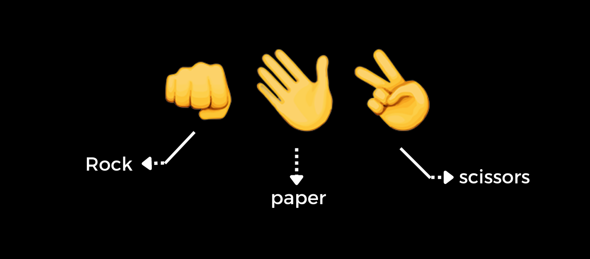

# Simple Python Game: Rock, Paper, Scissors

- Rock is won over scissors
- Scissor is won over Paper
- Paper is won over Rock

## Algorithms for Rock, Paper, Scissors

Step-1: import random module.

Step-2: create a list [rock,paper,scissor]

Step-3: take user input 0 --> rock, 1 --> paper, 2 --> scissor (user choice).

Step-3: using random.randint(0,2) generate random number from 0 to 2 (this is a computer choice).

Step-4: print user_choice and computer_choice.

Step-5: if user_choice == 0 and computer_choice == 2 then user will win (0 stand for stone and 2 stand for scissors).

Step-6: elif user_choice == 2 and computer_choice == 0 then computer will win (opposite of step-5).

Step-7: elif computer_choice > user_choice then computer win because now only two options are left 0 or 1 (0 for rock or 1 for paper). if computer_choice > user_choice means computer choice is 1 which is equal to paper and user choice is 0 which is equal to rock (paper won over a rock).

Step-8: elif user_choice > computer_choice then user wins (opposite of step-7).

Step-9: otherwise the game is a draw.

- 1. random module
- 2. python list
- 3. if-elif-else
- 4. python operators 

